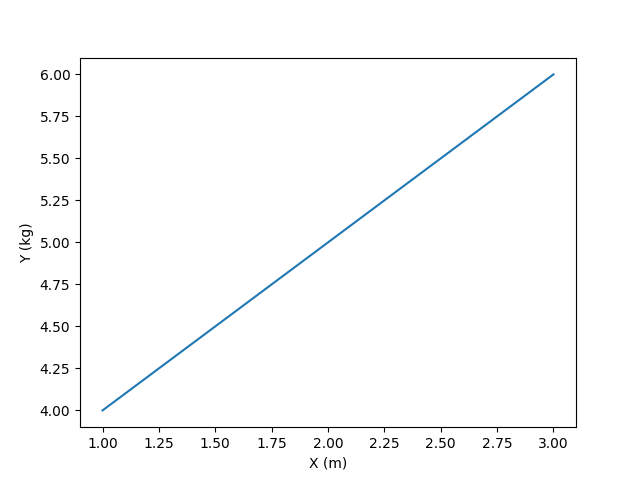
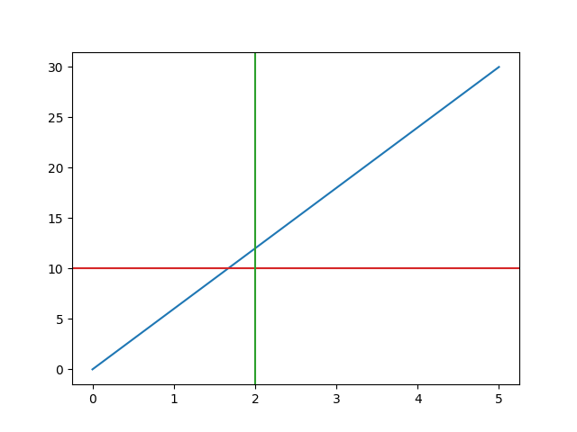

.. _plot:

========================
Plotting with Matplotlib
========================

PyAnsys Units provides a simple interface to plot quantities using `Matplotlib <https://matplotlib.org/stable/index.html>`_.

Basic usage
***********

The following example demonstrates how to plot data using lists.

.. code:: python

    import matplotlib.pyplot as plt
    from ansys.units import Quantity, QuantityPlotter

    x_quantity = Quantity([1, 2, 3], "m")
    y_quantity = Quantity([4, 5, 6], "kg")
    data = QuantityPlotter(x_quantity, y_quantity)
    fig, ax = plt.subplots()
    data.plot(ax)
    plt.show()

Using NumPy arrays
******************

The following example demonstrates how to plot data using `NumPy <https://numpy.org/doc/stable/>`_ arrays.

.. code:: python

    import matplotlib.pyplot as plt
    from ansys.units import Quantity, QuantityPlotter, UnitRegistry

    ureg = UnitRegistry()
    y = Quantity(value=np.linspace(0, 30), units=ureg.m)
    x = Quantity(value=np.linspace(0, 5), units=ureg.kg)
    data = QuantityPlotter(x, y)
    fig, ax = plt.subplots()
    ax.axhline(Quantity(10, ureg.m).value, color="tab:red")
    ax.axvline(Quantity(2, ureg.kg).value, color="tab:green")
    data.plot(ax)
    plt.show()

.. image:: ../_static/plot_np_array.png
   :alt: Plot example using NumPy arrays

Using NumPy arrays and no units
*******************************

The following example demonstrates how to plot data without units.

.. code:: python

    import matplotlib.pyplot as plt
    from ansys.units import Quantity, QuantityPlotter, UnitRegistry

    ureg = UnitRegistry()
    y = Quantity(value=np.linspace(0, 30))
    x = Quantity(value=np.linspace(0, 5))
    data = QuantityPlotter(x, y)
    fig, ax = plt.subplots()
    ax.axhline(Quantity(10, ureg.m).value, color="tab:red")
    ax.axvline(Quantity(2, ureg.kg).value, color="tab:green")
    data.plot(ax)
    plt.show()

