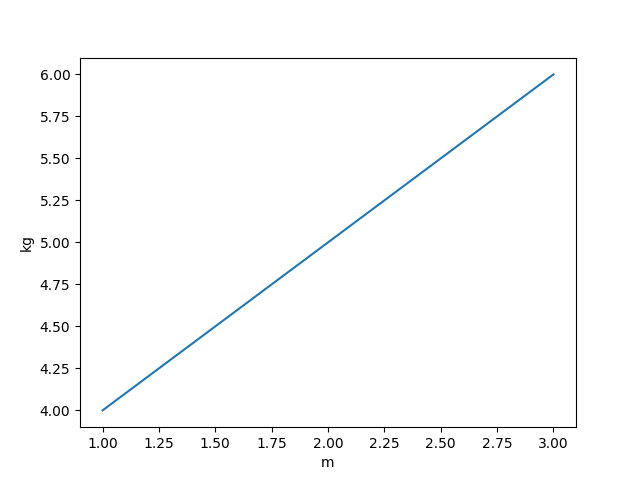
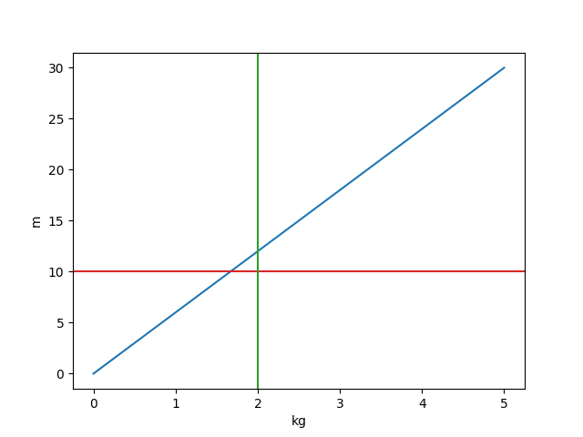

.. _plot:

========================
Plotting with Matplotlib
========================

PyAnsys Units provides a simple interface to plot quantities using `Matplotlib <https://matplotlib.org/stable/index.html>`_.

Basic usage
***********

The following example demonstrates how to plot data using lists.

.. code:: python

    import matplotlib.pyplot as plt
    from ansys.units import Quantity

    x_quantity = Quantity([1, 2, 3], "m")
    y_quantity = Quantity([4, 5, 6], "kg")
    fig, ax = plt.subplots()
    ax.plot(x_quantity, y_quantity)
    plt.show()

Using NumPy arrays
******************

The following example demonstrates how to plot data using `NumPy <https://numpy.org/doc/stable/>`_ arrays.

.. code:: python

    import matplotlib.pyplot as plt
    import numpy as np
    from ansys.units import Quantity, UnitRegistry

    ureg = UnitRegistry()

    y = Quantity(value=np.linspace(0, 30), units=ureg.m)
    x = Quantity(value=np.linspace(0, 5), units=ureg.kg)
    fig, ax = plt.subplots()
    ax.plot(x, y)
    ax.axhline(Quantity(10, ureg.m).value, color="tab:red")
    ax.axvline(Quantity(2, ureg.kg).value, color="tab:green")
    plt.show()

Using NumPy arrays and no units
*******************************

The following example demonstrates how to plot data without units.

.. code:: python

    import matplotlib.pyplot as plt
    import numpy as np
    from ansys.units import Quantity, UnitRegistry

    ureg = UnitRegistry()

    y = Quantity(value=np.linspace(0, 30))
    x = Quantity(value=np.linspace(0, 5))
    fig, ax = plt.subplots()
    ax.plot(x, y)
    ax.axhline(Quantity(10, ureg.m).value, color="tab:red")
    ax.axvline(Quantity(2, ureg.kg).value, color="tab:green")
    plt.show()

